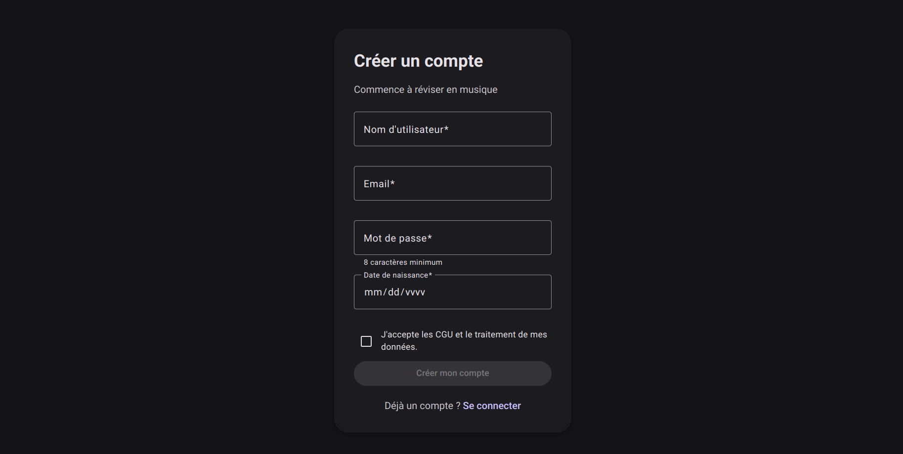
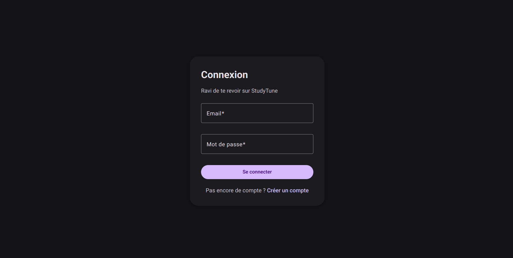
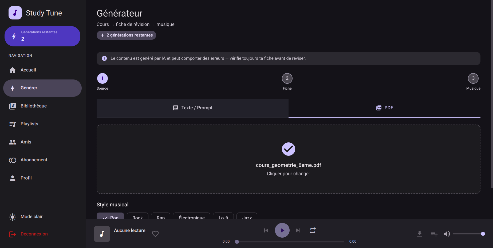
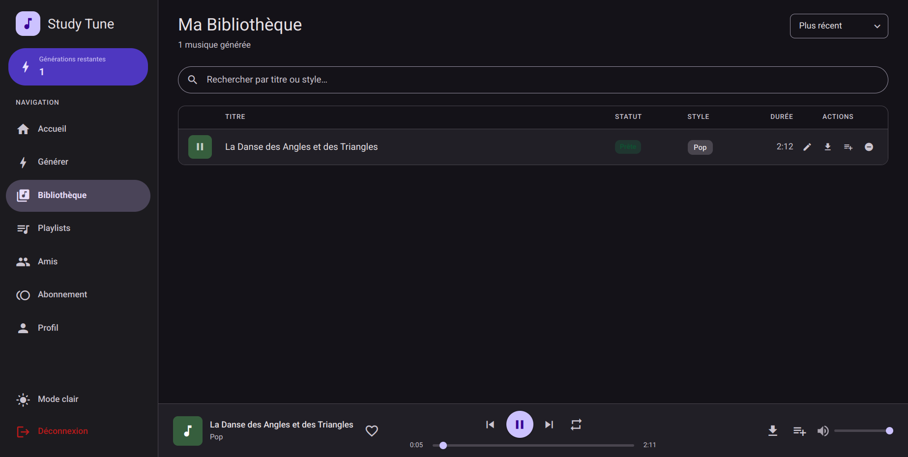
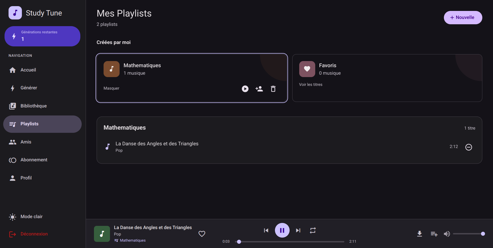
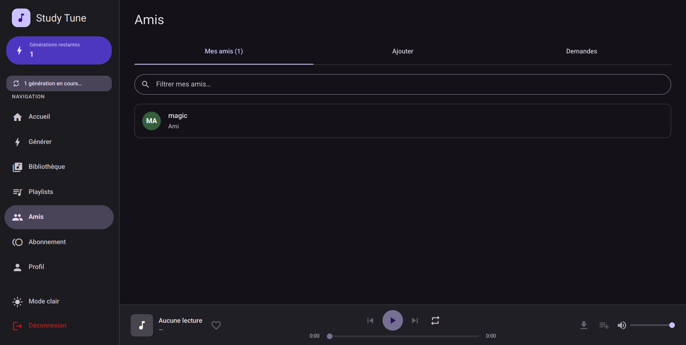
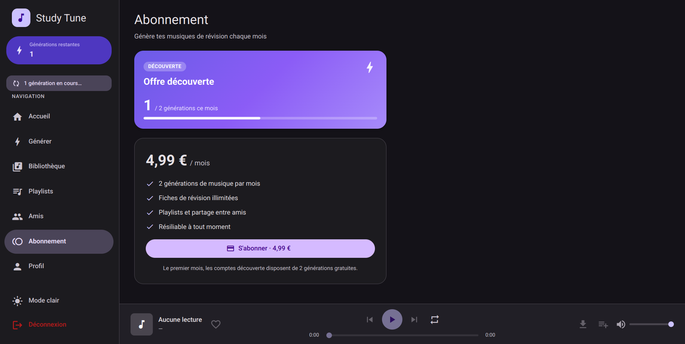
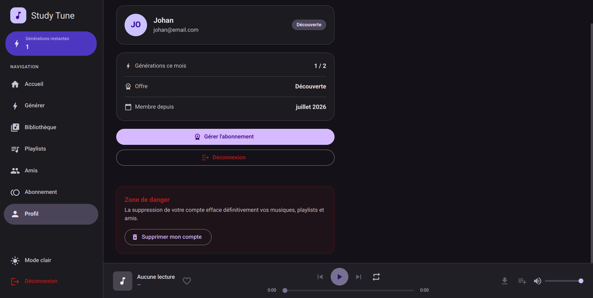

# Manuel d'utilisation

## Choix technologiques et raisons

L'interface est une application Angular à page unique (SPA), pensée mobile-first avec Angular
Material et un design system sombre/clair. La navigation est instantanée (routes lazy-loadées),
l'état est réactif (signals) et le lecteur audio est global : la musique continue en changeant de
page. L'authentification par JWT avec rafraîchissement automatique garde la session active sans
reconnexion.

## Parcours utilisateur

### 1. Inscription

Depuis `/register`, renseigner nom d'utilisateur, email et mot de passe (8 caractères minimum),
puis cocher le consentement au traitement des données (obligatoire). L'inscription connecte
automatiquement.

### 2. Connexion

Depuis `/login`, saisir email et mot de passe. En cas d'oubli de session, la reconnexion suffit.

### 3. Générer une musique

Page **Générer** :
1. Choisir la source : coller un texte de cours **ou** importer un PDF.
2. Générer la fiche : l'IA produit un titre, un résumé et des paroles.
3. Choisir un style musical (Pop, Rock, Rap, Électronique, Lo-fi, Jazz).
4. Lancer la composition. La génération est asynchrone : un indicateur signale l'avancement, et
   une notification s'affiche à la fin.

### 4. Écouter (bibliothèque + lecteur)

Page **Bibliothèque** : lister, rechercher, renommer, supprimer et télécharger les morceaux.
Cliquer une piste la lance dans le lecteur en bas d'écran (lecture/pause, position, volume,
répétition, file d'attente).

Le bouton **paroles** ouvre un panneau karaoké : les paroles défilent et le mot chanté se
surligne en temps réel, synchronisé à la lecture. Si l'alignement n'est pas encore disponible,
un bouton **Activer la synchronisation** le récupère. Le panneau reste accessible en version
mobile via le même bouton dans le lecteur.

### 5. Playlists

Page **Playlists** : créer des playlists, y ajouter/retirer des morceaux, et les partager avec des
amis. Les favoris sont une playlist par défaut non supprimable. Seul le créateur peut modifier une
playlist partagée.

### 6. Amis

Page **Amis** : rechercher des utilisateurs, envoyer une demande, accepter ou refuser les demandes
reçues (un badge signale les demandes en attente).

### 7. Abonnement

Page **Abonnement** : suivre le quota mensuel de générations restantes et passer premium
(abonnement simulé). Le quota se réinitialise chaque période.

### 8. Profil et suppression de compte

Page **Profil** : consulter ses informations, changer de thème, se déconnecter. La **zone de
danger** permet de supprimer définitivement le compte (musiques, playlists et amis effacés,
conformément au droit à l'effacement RGPD).

